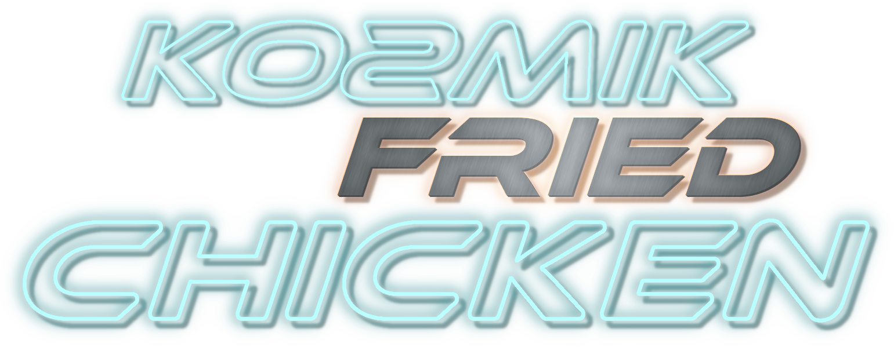
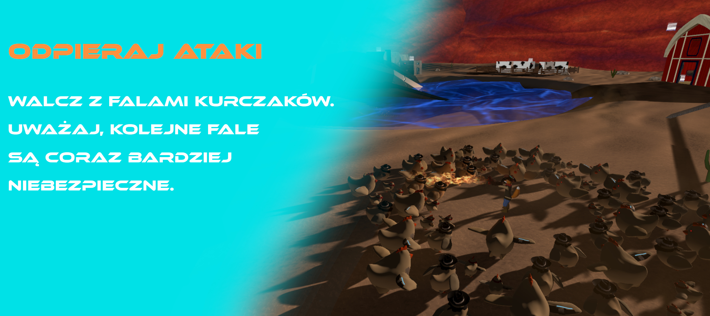
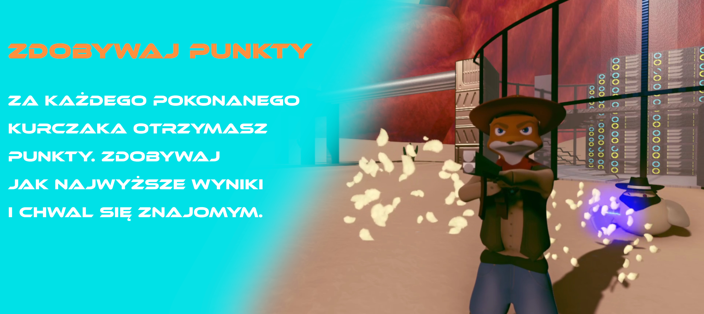
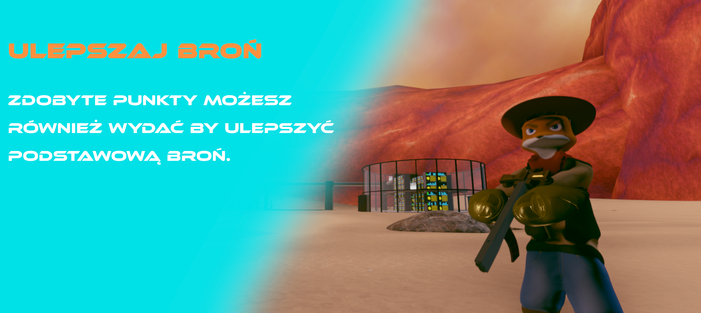

Repozytorium zawiera pliki źródłowe gry stworzonej w ramach jednego z przedmiotów na studiach magisterskich na specjalizacji Projektowanie Systemów CAD/CAM wydziału MiNI Politechniki Warszawskiej. Została ona przygotowana w kilkuosobowym zespole. 

Byłem osobą odpowiedzialną za sporą część modeli 3D (bez teksturowania) - w tym model głównego bohatera: kowboja lisa z kosmosu. Dodatkowo, jak każdy członek zespołu, miałem swoje zadania związane z gameplayem i mechanikami. 

Dla poprawy imersji przygotowałem również klimatyczne elementy takie jak specjalny shader dla pustyni, surrealistyczne oczko wodne, efekty cząsteczkowe mgły, płomieni i laserów czy otaczające lokację góry.

Poniżej zostały przedstawione grafiki mające reklamować przygotowaną grę.

