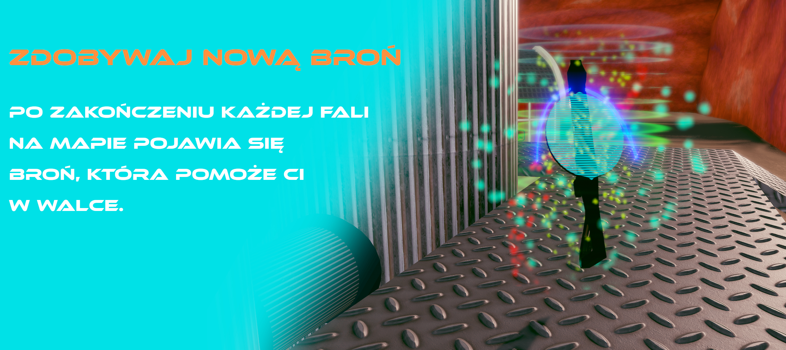

# Kosmic Fried Chicken: Unity Game Repository

## Introduction

Welcome to the repository for "Kosmic Fried Chicken"! This game was a collaborative project developed as part of a master's degree course at the Warsaw University of Technology's Faculty of Mechatronics, specializing in CAD/CAM Systems Design.

## Team Contributions

Within our small, dedicated team, I primarily focused on 3D modelling. Notably, I developed a significant part of the 3D models, including the main character: a cosmic fox cowboy.

Like every member of the team, I also had an active role in gameplay and mechanics development. Our collaborative efforts ensured a seamless and engaging gaming experience.

## Enhancements & Special Features

To augment the immersive experience of the game, I also took part in creating atmospheric elements. These include:

- A special shader for the desert environment
- A surreal water body effect
- Particle effects for fog, flames, and lasers
- Surrounding mountains as an atmospheric backdrop

## Game Mechanics

The game introduces a variety of dynamic mechanics that keep the gameplay interesting:

1. **Enemy Waves**: The game presents players with waves of enemies, each with different types of adversaries to challenge the player's skills and strategies.
2. **Teleport Portals**: Portals are strategically placed across the map, providing quick navigation and adding an extra dimension to the gameplay.
3. **Random Weapon Drops**: With each new wave, a weapon is randomly located somewhere on the map. This mechanic encourages exploration and rewards quick and smart maneuvering.
4. **Varied Weapon Parameters**: Weapons in the game have different attributes such as fire range and cooldown, offering diverse combat experiences.
5. **Weapon Upgrade System**: A basic weapon upgrade system is in place to enhance player progression and allow for customization based on personal play style.

## Technologies

The game and its features were brought to life using a selection of top-tier development tools:

- **Unity**: Our chosen game engine for its powerful and versatile game development capabilities.
- **Blender**: Used for the creation and modelling of 3D assets.
- **GIMP**: Leveraged for texturing and creating graphics.
- **Perforce**: A robust version control system that housed our repository and facilitated our collaborative efforts.

## Game Promotion Graphics

The following graphics are intended to promote "Kosmic Fried Chicken", highlighting some of its unique features and atmosphere.

(Please insert the relevant graphics here)

## Usage & Contribution

Feel free to explore the repository. I encourage you to provide feedback and any contributions to improve "Kosmic Fried Chicken". Please see the 'Contributing' section for more information on how you can be part of this project.

## Contributing

I welcome contributions from the community. If you're interested in contributing, please follow these steps:

1. Fork the repository
2. Create your feature branch: `git checkout -b feature/YourFeature`
3. Commit your changes: `git commit -am 'Add some feature'`
4. Push to the branch: `git push origin feature/YourFeature`
5. Submit a pull request

## License

This project is licensed under the [MIT License](LICENSE).

